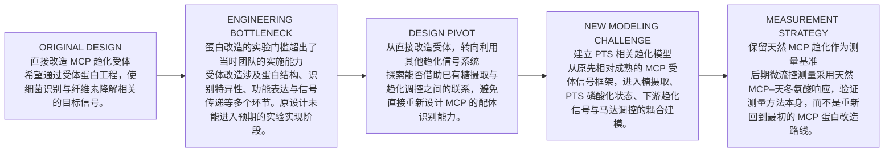

PTS模型是我们根据MCP已有的工作做的新工作，这个是创新的，我们刚搞出来的，优势是原创，劣势是我们要审慎说明其数学机制和取舍。

围绕四个问题建立证据：

1. 数学机制是否正确？
	来自真人撰写的数学分析，这个部分对标其他人的数学机制分析。我们同时有模块，可以对模块做输入输出扫描。同时说明白我们在建模初期的贪多求大和取舍。分析一个唯象的模型建造过程带来的坏处，同时可以一定程度上的指出ai辅助建模的注意点，体现我们的安全观。
    
2. 数值实现是否可靠？
	比较难的一环，主要是我们缺少实际数据，我们可能需要首先检查现有数据/文献数据，找出模型数据的合理范围。然后对模型数值进行敏感性分析（扫描/模拟），最后给出一个合理的数值选择的理由。
    
3. 趋化在什么条件下有效？
	这个就是终极问题了，我们应该选择一个更能说明的指标，直观的趋化不管是实际湿实验还是模拟，都在有限条件下聚集不明显，我们应该放下那种极度精确的执念，选择合适的指标（比如碰撞次数，做对比排除无关因素，可知有限）
	
	
4. 模型能否与实验相互验证？
	主要聚集在测量环节。PTS可以与现实互证不完全成功，指出我们通过建模测量，发现我们一开始设想的情况还是会有过于天真的倾向，我们一厢情愿的构建工程菌，建立模型，但实际上的复杂性和相互作用都会让趋化工程的效果变得不那么明确可见。

## 建议的模型计算任务
*正式 Wiki 发表之前必须解决的模型可信度问题*
**PTS 动态适应实验**　**P0**
阶跃刺激与脉冲刺激，比较含适应、无适应和不同适应速率条件。

**固定源与动态源对照**　**P0**
分别研究恒定信号输出、底物耗竭和细胞摄取反馈，明确源强是否可比。

**边界效应与趋化效应分离**　**P0**
比较不同边界规则下的无趋化、正常趋化和运动参数匹配对照。

**网格与时间步收敛性**　**P0**
检查 dx、dt 改变后浓度场、接触率和富集统计是否稳定。

*能够形成主要科研图表的分析*
**PTS 参数敏感性**　**P1**
研究摄取半饱和参数、信号耦合、适应速率和马达响应参数。

**传质参数二维扫描**　**P1**
扫描信号产生强度与扩散系数，并在多个摄取水平下比较。

**运动参数敏感性**　**P1**
扫描游动速度、翻转频率和运动持久性，研究到达时间及接触行为。

**完整模型与约化模型对比**　**P1**
检验增加的机制是否真正改变可观察预测，避免无必要的模型复杂化。

**多随机种子统计**　**P1**
报告均值、置信区间、效应量及重复运行之间的变异。

*依赖实验数据和软件开发进度*
**微流控几何预测**　**P2**
使用与实验一致的流道尺寸、梯度边界和观察区域输出预测分布。（已存在，待对照）

**AI 检测误差传播**　**P2**
用人工标注参考集评价检测误差，并分析其对趋化指标的影响。

model里面讲四个部分

早期的MCP建模，中期的PTS建模（模拟和唯像的模拟）
这部分要检查代码，尽可能做到代码整齐可控，数据分类可查。
后期的软件模块化模拟和微流控测量/模拟一体化对照（反思贪多求大，正确的AI软件开发流程）
这部分要尽量厘清软件仓库的技术债，精简文档并关注使用流程，有可能的话，尽量找人去测试使用（陌生人、iGEM社区队员、身边同学、利益相关者（最好是趋化研究者））
Linker模型（待补充）
AI的YOLO视觉模型（）

## 模型敏感性分析可以怎样展示？

可以设计成读者能切换评价指标的交互热力图。例如，下面只是一个展示形式的示意，数字不代表 FriskoliCAD 的实际计算结果。
![[Pasted image 20261008200443.png]]

第一层：局部敏感性。 先在基准参数附近做小扰动，检查各参数对关键输出的影响，快速识别明显不敏感的参数。

第二层：全局敏感性。 在有依据的参数区间内进行 Latin Hypercube、Morris 或 Sobol 分析。若模拟成本较高，可先用 Morris 筛选，再对少数重要参数进行更精细的分析。

第三层：参数交互作用。 重点研究信号源强度、扩散、摄取、运动速度与信号适应之间的组合效应。因为趋化招募很可能取决于多个过程之间的相对时间尺度，而不是单一参数。

所有分析都应该报告参数取值范围的来源。否则敏感性排名可能更多反映人为选择的扫描范围，而非机制本身的重要性。

| DBTL 阶段        | 核心科学问题           | 需要的证据                       |
| -------------- | ---------------- | --------------------------- |
| 早期 MCP 模型      | 细胞能否对化学梯度产生统计迁移？ | 理想情况下的趋化分布、基准模型             |
| 空间扩散模型         | 局部降解能否产生足够的梯度？   | 浓度场、源强扫描，敏感区间确认             |
| PTS 信号模型       | 糖摄取如何连接运动调控？     | 通路结构、剂量响应、动态适应（PTSMCP机制图）   |
| 耦合模型           | 细胞运动与底物转化能否相互影响？ | 动态源、固定源对照（源/汇问题）            |
| 模型审查           | 富集是否来自真正的趋化？     | 无趋化对照、边界效应分析（对照分析）          |
| 模块化重构          | 模型能否逐层验证与替换？     | 模块测试、接口检查（我们本身就迁移了旧模型进入模块化） |
| Measurement 关联 | 模型如何与显微实验比较？     | 共同统计指标、实验拟合（干湿实验互证）         |
| AI 视觉模型        | 实验影像能否可靠转化为数据？   | 检测性能、误差传播（构建可信的训练集）         |

边界滑动引起的驻留、固定源与动态源的对照差异、统计时间点问题，以及 PTS 信号适应位置的修正（人为审核AI带来的误差）。

发现问题、提出修正、完成代码修改、通过测试，是四个不同状态。 只有完成对应验证后，才能将该轮 DBTL 标为已解决。

## AI 视觉模型在 Model 页
作为一个相对独立的计算模型章节
AI 视觉模型在 Model 页写训练数据、模型选择依据、损失函数或训练策略、验证集设计、性能指标与误差传播。
Measurement 页则重点讨论它如何影响最终实验结论。

Software 页再展示推理流程、操作界面、文件输入输出、运行性能和安装方法。（这个模型也要作为测量方法开源发布）

目标检测、跨帧追踪、趋化性判定

|        |                                 |                                 |
| ------ | ------------------------------- | ------------------------------- |
| **01** | **Hero**                        | 分子信号到细胞运动的动态跨尺度视觉               |
| **02** | **Scientific Question**         | 为什么必须建模，以及研究的六个层次               |
| **03** | **Model History**               | 早期 MCP → 扩散 → PTS → FriskoliCAD |
| **04** | **Mathematical Framework**      | 扩散、摄取、运动、边界和接触的方程               |
| **05** | **PTS Chemotaxis**              | 自制信号模型、机制依据、适应与灵敏区间             |
| **06** | **Model Architecture**          | 软件模块与完整数据通路                     |
| **07** | **DBTL Journey**                | 模型开发史、失败、修正与验证                  |
| **08** | **Sensitivity Analysis**        | 参数敏感性、交互作用、不确定性                 |
| **09** | **Simulation Results**          | 到达、接触、降解与对照                     |
| **10** | **AI Vision Model**             | 训练、验证、误差与实验关联                   |
| **11** | **Model–Experiment Bridge**     | 微流控与模拟的共同指标                     |
| **12** | **Limitations & Contributions** | 局限、复现材料与最终贡献                    |
PTS 是机制研究的核心，DBTL 是科学研究过程的核心，敏感性分析与对照模拟是可信度的核心，FriskoliCAD 是模型走向工具化的成果，AI 视觉模型则负责连接真实实验。

## 早期实验
我们的转折是我们的实验能力不足以 carry MCP蛋白直接改造的技术含量。所以一开始改造 MCP 受体的计划没有被实现。然后才转型了其他趋化系统。

所以MCP 并不只是最初选择的简化验证模型，而是最初计划直接进行工程改造的趋化受体系统。后来由于实验技术条件的限制，才转向其他趋化机制。

区分两次分别使用的 MCP：

- 早期 MCP：工程设计路线。 目标是改变受体的识别能力，但没有实现计划中的蛋白改造。但成型了趋化模拟部分。
    
- 后期 MCP：实验测量路线。 利用天然趋化响应作为微流控测量的参考体系，不需要改造 MCP 识别特异性。

这两者在 Wiki 中必须明确区分，否则读者可能误以为我们从 MCP 转到 PTS，最后又转回 MCP，整个项目方向反复摇摆。实际上，后期改变的是测量策略，没有恢复最初的工程设计。

## DBTL I — Rethinking Chemotactic Recognition

### From Receptor Engineering to Alternative Signaling Pathways

_When our first design exceeded our experimental capabilities, we reconsidered how bacteria could recognize the target signal._

Friskoli 最初的设计思路，是直接改造细菌的趋化受体。

我们希望通过对 MCP（Methyl-accepting Chemotaxis Protein）相关受体进行工程改造，使细菌能够识别与纤维素降解有关的目标化学信号。

这一思路具有直接的逻辑：如果能够改变趋化受体的识别特异性，便有可能利用细菌已有的下游趋化信号网络，将新的环境信号转化为运动响应。

然而，随着项目设计逐渐深入，我们意识到，这一方案对实验能力提出了较高要求。

改变受体的配体识别能力，并不只是将一个新的基因导入细胞。

它可能涉及受体结构与功能的重新设计、蛋白表达、配体结合验证，以及改造后的受体能否将信号正确传递至下游趋化网络等问题。

对于当时的团队而言，直接完成这一系列蛋白工程改造和功能验证，超出了我们能够可靠实施的实验技术范围。

因此，最初的 MCP 受体改造方案未能按照预期实现。

但这一困难促使我们重新审视了项目最基本的需求。

**我们真正需要的，是让细菌能够将底物相关的化学信息转化为运动调节，而不一定必须通过直接改造 MCP 的配体结合能力来实现。**

### Design

我们重新提出问题：

是否存在其他已经具有生物学基础的信号通路，能够将目标化学物质的摄取或代谢状态与细菌趋化调控联系起来？

### Build

我们开始研究替代性的趋化信号机制，并逐渐将注意力转向糖摄取相关的 PTS 系统。

这一设计转变，使我们能够探索利用已有信号网络的可能性，而不必将整个项目建立在尚未实现的受体蛋白重新设计之上。

与此同时，这也带来了新的建模任务。

传统 MCP 受体介导的趋化模型，不能直接等同于 PTS 相关趋化模型。

我们需要重新考虑外部糖浓度、摄取通量、磷酸化状态、趋化信号和细胞运动之间的联系。

### Test

在模型层面，我们需要检查新的信号路线是否具有明确的生物学依据。

特别是：

PTS 相关输入是否能够影响趋化调控？

信号变化的方向是否与吸引性趋化一致？

下游适应过程应当如何处理？

这种机制在什么浓度和参数条件下可能产生可观察的运动响应？

这些问题构成了后续 PTS 数学模型开发的基础。

### Learn

这次设计调整让我们认识到，工程方案不仅需要具有理论上的可行性，也必须考虑实际的实验能力与验证条件。

一个具有吸引力的蛋白工程构想，如果缺乏相应的实施与验证能力，就难以成为可靠的项目成果。

因此，我们决定调整技术路线，将研究重点从直接改造 MCP 受体，转向探索其他能够连接化学信号与细菌运动的机制。

这一转折也改变了 Friskoli 的模型开发方向。

我们的模型不再只需要描述经典受体介导的趋化行为，还需要研究糖摄取相关信号如何通过细胞内部网络影响运动。

**What we learned: A different biological mechanism requires a different mathematical model.**

[Next DBTL → Modeling PTS-Associated Chemotaxis]

这次转型写成 Engineering 页与 Model 页之间的第一个重要交叉节点。Engineering 讲为什么原有设计无法实施，以及为什么选择新方案；Model 则讲新方案提出了哪些不同的数学问题。

## 建模的取舍
我们的聚集效应因为存在非常多的效应影响，不一定总是能够视觉上直观。毕竟趋化是一个随机过程，且我们的正反馈效应并不总是显著，降解效率，菌体所处的尺度，环境的复杂性异质性等因素都可能影响聚集效应的表现。更核心的指标应该是趋化带来的碰撞频率增加。（或许）

聚集是细胞在空间中的分布状态，而趋化本质上是一种改变运动统计的机制。即使存在有效趋化，细胞也不一定形成肉眼可见的高密度区域。

- 细胞持续到达目标，也持续离开目标，局部密度未必明显增加。
- 目标表面存在边界滑动或滞留，可能在没有趋化的情况下产生明显聚集。
- 信号产生较弱、扩散较快或摄取较强时，趋化响应可能不足以形成稳定的空间富集。
- 细胞可能在较短时间内提高接触频率，却没有形成长期的聚集状态。
- 在复杂、异质的环境中，不同位置的局部响应可能相互抵消，使整体分布看起来变化很小。

因此，没有明显聚集，不等于没有趋化效应；出现明显聚集，也不等于趋化提高了有效传质。

从追求可见的细菌聚集，转向评价趋化是否真正改善细胞与底物之间的有效相遇。
从长时间等待细菌成长、进一步加倍富集，膜表面积增大，转向短期快速实验，验证单位时间内，纯粹因为趋化机制带来的提升。
短期模拟和长期模拟的问题，我们一开始瞄准长期模拟，加入了黏附和分裂生长机制等。长期看来确实是更多正反馈，但模拟精度也是有取舍的。后来保留了这个生长系统但简化了黏附（本质是碰撞的延长），也没继续使用黏附了（加了黏附图会很好看，即使情况比较糟，随机游走在只会贴底物的情况下也会看着很聚集）
长期模拟中观察到更强的正反馈，并不意味着趋化本身更有效。 细胞数量增长、表面滞留、局部底物转化和趋化招募可能共同影响结果。必须通过消融实验才能区分它们。

## DBTL — Choosing the Right Timescale

### From Long-Term Population Dynamics to Short-Term Encounter Mechanics

_More mechanisms do not always produce a more informative model._

在 Friskoli 的早期建模工作中，我们希望尽可能完整地描述生物反应器中的长期过程。

我们的研究不仅关注细菌如何在化学梯度中运动，还希望进一步模拟细胞与底物接触之后可能发生的变化。

如果细胞能够到达目标表面，它们是否会停留？

如果细胞在局部持续生长并发生分裂，是否会形成更高的细胞密度？

如果更多细胞在目标附近产生降解产物，是否会进一步吸引其他细胞？

这些问题促使我们在早期模型中引入了细胞黏附、生长和分裂机制。

### Design — A Long-Term Bioreactor Model

最初，我们试图建立一个能够描述较长时间尺度下细胞群体变化的模型。

在这一模型中，细胞不仅能够游动和响应化学梯度，还可能与目标表面发生黏附，并在满足条件时生长和分裂。

这些机制使模型能够探索一种更复杂的反馈过程：

细胞到达目标区域；

部分细胞在局部停留；

细胞生长与分裂可能增加局部数量；

更多细胞参与底物转化；

底物转化又可能改变周围的化学环境。

从理论上看，这种过程可能产生比单纯短期趋化更加明显的局部富集。

### Build — Adding Adhesion and Growth

为了研究这些现象，我们在运动与化学场模型之外，进一步加入了与细胞生长、分裂和表面相互作用有关的规则。

模型因此能够描述更加复杂的细胞群体行为。

与此同时，模拟也需要处理更多状态变量与事件。

细胞数量不再固定。

单个细胞的生命周期需要更新。

表面相互作用需要额外的判断。

局部细胞数量变化还可能影响底物消耗与化学信号分布。

这些扩展使模型更加接近我们最初设想的长期生物反应器场景，但也带来了新的计算与验证问题。

### Test — Stronger Feedback, Greater Complexity

在早期长期模拟中，我们观察到，加入生长、分裂和表面滞留相关机制后，系统可能表现出更加明显的局部积累和反馈效应。

但随着分析深入，我们意识到，这些结果不能直接归因于趋化。

局部细胞数量增加，可能来自细胞主动迁移，也可能来自已经到达的细胞在原位分裂。

细胞在目标附近停留，可能来自趋化运动，也可能来自黏附或其他表面相互作用。

即使局部底物转化增强，也需要进一步判断这种变化是由更多细胞到达造成，还是由局部生长带来的细胞总量增加造成。

因此，长期模拟虽然能够展示复杂的系统行为，却未必能够清晰回答我们最核心的问题：

**趋化本身究竟为细胞与底物的有效相遇带来了多少额外贡献？**

与此同时，更复杂的模型还意味着更多参数需要确定。

细胞生长速率、分裂条件、黏附概率、脱附行为以及局部营养状态，都可能影响长期结果。

如果这些参数缺乏可靠的实验约束，那么增加机制复杂度并不一定提高预测的可信度。

### Learn — Complexity Must Serve the Research Question

我们逐渐认识到，模型的复杂程度应当由研究问题决定。

对于长期生物反应器运行，细胞生长、分裂和表面滞留可能十分重要。

但对于研究趋化是否提高细胞与目标底物之间的短期相遇效率，过多的长期机制可能掩盖真正需要分析的运动过程。

因此，我们调整了模型开发重点。

在后续研究中，我们更加关注短期时间尺度上的细胞运动、信号响应、到达事件和有效接触。

我们保留了已有的生长系统，使模型仍然具备扩展至群体动力学研究的可能。

但对于当前主要的趋化与碰撞研究，我们不再将细胞黏附作为默认机制，而是采用更加简化、可明确解释的细胞—表面接触规则。

这一调整有助于减少不必要的参数依赖，也使我们能够更直接地比较有无趋化时的相遇行为。

### Next Iteration — Separating Encounter from Retention

模型简化后，我们仍然需要认真处理细胞与表面之间的相互作用。

即使不引入生物学意义上的黏附，细胞与目标表面发生碰撞后，边界处理方式仍然可能影响其运动和驻留时间。

因此，我们进一步区分了：

首次到达目标表面；

发生接触或碰撞；

沿表面运动；

持续驻留；

以及离开后再次接触。

这使我们能够更加明确地评价细胞运动对有效相遇的贡献，而不是将所有目标附近的细胞积累都视为趋化效果。

### What We Learned

这次模型调整让我们认识到，模型精度并不等于机制数量。

对于一个需要接受实验检验的模型而言，机制是否具有可靠依据、参数是否能够确定，以及结果能否归因于具体过程，往往比模型是否包含更多功能更加重要。

长期模型帮助我们探索了生长、表面相互作用与趋化之间可能存在的复杂反馈。

短期模型则帮助我们更加集中地研究趋化驱动的微尺度相遇。

两者回答的是不同的问题。

**The best model is not necessarily the most complicated one. It is the one that makes the research question testable.**

从贪大求多，到精简求小

![[Pasted image 20261008202959.png]]

| 指标                                | 物理含义             | 用途         |
| --------------------------------- | ---------------- | ---------- |
| 首次到达时间 \(T_{\mathrm{first}}\)     | 细胞第一次进入目标区域所需时间  | 评价寻找效率     |
| 首次碰撞通量 \(J_{\mathrm{hit}}\)       | 单位时间、单位面积的首次接触事件 | 评价细胞向目标的输运 |
| 重复接触频率 \(f_{\mathrm{contact}}\)   | 单位时间内发生的接触事件数量   | 评价动态相遇过程   |
| 累计有效接触时间 \(T_{\mathrm{contact}}\) | 细胞与目标保持有效接触的总时长  | 评价反应机会     |
| 接触条件下的转化量 \(Q\)                   | 一定时间内实际完成的底物转化   | 评价最终效果     |
| 局部富集倍数 \(E\)                      | 目标区域细胞密度与对照的比值   | 辅助解释空间分布   |

趋化Benchmark

**假设实验或模拟中观察到单位时间有 $J_{\mathrm{chem}}$ 次有效相遇，而运动参数和边界条件匹配的无趋化对照为 $J_{\mathrm{ctrl}}$。

那么可以定义：

$$
G_{\mathrm{encounter}}=\frac{J_{\mathrm{chem}}}{J_{\mathrm{ctrl}}}
$$

以及：

$$
\Delta J_{\mathrm{encounter}}=J_{\mathrm{chem}}-J_{\mathrm{ctrl}}
$$

前者是相对提升，后者是绝对提升。

二者都重要。尤其当对照组相遇率极低时，较大的倍数提升可能仍然对应很小的绝对增加。

还需要保证两组具有可比较的细胞数量、运动参数、边界规则、底物分布及信号源条件。对于动态反馈系统，最好另外设置固定源强对照，避免将源项变化误认为纯粹的趋化贡献。

## Beyond Aggregation

### Why Encounter Matters More Than Appearance

_Chemotaxis does not always create a visible cluster. Its contribution may instead appear in the statistics of microscopic encounters._

在 Friskoli 的早期模拟中，我们曾经将细菌在底物附近的聚集视为评价趋化效果的重要依据。

这一思路具有直观性。

如果细胞能够感知由底物降解产生的化学信号，并向信号源所在区域迁移，那么我们可能观察到目标附近细胞密度的提高。

然而，随着模型逐渐完善，我们发现，空间聚集并不能完整描述趋化对物质输运的贡献。

### Chemotaxis Is a Stochastic Process

细菌趋化并不是朝向目标的确定性运动。

对于采用 run-and-tumble 运动方式的细菌，趋化通过改变运动统计，使细胞在特定方向上的平均运动行为产生偏向。

单个细胞仍然可能远离目标。

不同细胞的轨迹也可能存在显著差异。

因此，即使趋化机制有效，有限时间内的细胞分布仍然可能受到随机波动影响。

当细胞数量较少、观测时间较短或趋化偏向较弱时，这种随机性尤其值得关注。

我们不能仅凭一张模拟截图或某一次实验中的局部密度变化，判断趋化是否发挥了作用。

### Aggregation Is Influenced by Multiple Mechanisms

细胞聚集还受到许多非趋化因素的影响。

细胞与目标表面接触后的运动方式，可能改变其局部驻留时间。

边界几何可能限制细胞运动方向。

流体输运可能使细胞在特定区域积累。

底物附近的物理结构也可能影响细胞分布。

与此同时，趋化信号本身并不一定能够形成稳定的空间梯度。

局部酶活性、信号产生速率、扩散系数、细胞摄取和环境异质性，都可能影响细胞能够获得的方向信息。

因此，即使出现明显的局部富集，我们仍然需要通过适当的对照，判断其中有多少可以归因于趋化。

### Positive Feedback Is Conditional

Friskoli 的设计包含一种潜在的正反馈机制。

细胞在目标附近进行底物降解，产生可溶性化学信号。

这些信号可能吸引更多细胞接近目标。

更多细胞到达后，又可能进一步增加局部底物降解活动。

但这种正反馈并不必然出现，也不一定总是显著。

它需要多个过程在时间和空间上形成适当的配合。

如果局部降解产物产生过慢，细胞可能无法感知足够强的信号。

如果扩散过快，浓度梯度可能难以维持。

如果摄取消耗过强，信号可能在到达较远位置前被消耗。

如果细胞的运动响应较弱，局部信号也未必能够带来显著的空间重新分布。

此外，正反馈可能受到底物耗竭、信号饱和和其他限制因素影响。

因此，我们将正反馈视为需要检验的条件性预测，而不是工程设计必然具有的结果。

### From Aggregation to Encounter

这些认识促使我们重新考虑模型的核心评价指标。

Friskoli 最初希望解决的，并不是如何让细菌形成更加密集的群体。

我们真正关注的是，在自然对流减弱、有效相遇可能受到限制的环境中，细菌能否通过主动运动增加与目标底物的相遇机会。

因此，我们开始将研究重点从静态聚集转向动态相遇。

与局部细胞密度相比，细胞到达目标的速率、接触事件的发生频率以及有效接触时间，可能更直接地反映趋化对局部物质输运的贡献。

这一变化也帮助我们将研究问题拆解得更加清楚。

**Does chemotaxis increase arrival?**

趋化是否提高细胞到达目标区域的速率？

**Does arrival lead to contact?**

更多的到达是否转化为更多有效接触？

**Does contact improve conversion?**

接触变化是否进一步提高底物转化？

这些问题相互联系，但需要分别验证。

### A New Primary Metric

为了定量评价趋化对细胞—底物相遇的影响，我们计划将目标表面的接触通量作为重要指标。

对于给定目标表面，我们可以统计单位时间内发生的首次接触事件，并在适当条件下将其归一化为单位面积的首次到达通量。

同时，我们将进一步记录重复接触事件、累计接触时间以及接触的空间分布。

通过与运动和边界条件匹配的无趋化对照进行比较，我们希望估计趋化机制对相遇过程的额外贡献。

局部富集倍数仍然是有价值的辅助指标，但不再单独承担评价整个工程效果的任务。

### A More Testable Hypothesis

这一调整使 Friskoli 的研究假设更加明确。

我们不再要求趋化一定产生肉眼可见的细胞聚集。

相反，我们希望检验，在明确的参数与环境条件下，趋化能否提高细胞到达和接触目标底物的统计速率。

如果这一效应存在，我们将进一步研究它是否能够带来底物转化的实际改善。

如果这一效应不显著，我们也希望通过模型解释其原因。

是信号梯度不足？

是细胞感知能力受到限制？

是运动参数不合适？

还是复杂环境中的其他过程抵消了趋化的贡献？

这些问题能够帮助我们识别 Friskoli 的适用条件与局限。

**Our goal is not simply to make bacteria gather. It is to understand whether directed movement can make microscopic encounters more effective.**

这会形成一个很值得研究的现象：某些参数组合下，趋化可能增加细胞与底物的动态相遇，却未必形成显著的稳态富集。
相反，某些情况下局部富集很高，但主要来自表面滞留，实际新增的首次相遇通量可能有限。

| | 相遇率提升低 | 相遇率提升高 |
|---|---|---|
| **聚集提升低** | 趋化效果不明显 | 隐性主动传质效应 |
| **聚集提升高** | 表面驻留或其他富集机制值得排查 | 聚集与相遇同时增强 |

这只是用于组织研究问题的分类框架，不能预先认定四种情况都会在真实参数范围内出现。

固定细胞数量、几何条件、源项和基础运动统计，比较有无趋化时的首次到达通量、接触时间分布与局部富集倍数。 随后再加入动态降解反馈，检查正反馈是否在特定参数范围内带来额外增益。

## 短期与长期模型应如何比较？

| 比较维度   | 短期运动模型            | 长期群体模型                 |
| ------ | ----------------- | ---------------------- |
| 主要研究问题 | 趋化如何改变到达和接触       | 细胞群体如何随时间演化            |
| 细胞数量   | 可固定               | 允许生长与分裂                |
| 表面行为   | 碰撞、滑动、离开          | 可加入黏附、脱附等机制            |
| 主要输出   | 首次到达率、碰撞通量、接触时间   | 群体数量、局部密度、累计转化         |
| 参数需求   | 相对集中              | 更多生理与动力学参数             |
| 趋化贡献归因 | 相对容易              | 需要更多机制消融对照             |
| 主要限制   | 无法描述长期群体演化        | 计算成本与参数不确定性可能更高        |
| 资源消耗   | 模型精度带来的梯度细节，时间步细节 | 长时运行加速带来的超长模拟生长分裂分化正收益 |

长期模型不是天然更差，也不是短期模型必然更准确。
实际选择是：优先保证当前科学问题的可辨识性和计算可验证性，同时保留未来研究长期群体动力学的扩展能力。

## 消融实验

可选的机制消融矩阵

|   |   |   |
|---|---|---|
|模拟组|启用机制|目的|
|A|随机运动 + 碰撞|建立无趋化基准|
|B|A + 趋化|识别短期趋化贡献|
|C|A + 生长分裂|识别细胞增殖贡献|
|D|B + 生长分裂|研究趋化与增殖的交互|
|E|A + 黏附|估计表面滞留效应|
|F|B + 黏附|研究趋化与黏附的交互|
|G|B + 生长 + 黏附|历史长期完整模型|

E、F、G 仅建议在旧黏附机制能够可靠恢复和复现时作为历史消融实验；不需要为了展示而重新引入已弃用的机制。

第一类是运动指标，例如首次碰撞通量、首次到达时间、接触时间分布。第二类是群体指标，例如细胞总数、目标附近细胞密度、局部增长比例。第三类是转化指标，例如单位时间的底物降解量、单位初始细胞数的累计转化量，以及固定细胞数量条件下的转化效率。

尤其要注意：长期模型中细胞数量变化会影响总碰撞次数。只比较绝对碰撞次数可能使生长组天然占优。因此，最好同时报告按细胞数量或细胞暴露时间归一化的接触指标。

黏附、碰撞和沿壁滑动不是同一种机制。 黏附通常意味着细胞与表面之间存在一定持续性的结合；碰撞是一次接触事件；沿壁滑动则是碰撞后的运动边界规则。你们后续放弃黏附，并不意味着消除了所有表面驻留效应。

把这段历史与之前的 MCP → PTS 转型结合起来，Model 页就有了两次具有明确因果关系的重大设计调整：第一次是生物学可实现性的取舍：从直接改造 MCP 转向 PTS 相关信号。第二次是建模可解释性的取舍：从包含生长、分裂与黏附的长期模型，转向以短期趋化和有效碰撞为核心的模型。生长与形态模块并没有被放弃，而是仍然保留在 FriskoliCAD 中，只是随着研究重心转向短期趋化与碰撞，它不再是当前模型验证的重点。

- 短期模拟： 更关注运动、信号、碰撞及局部接触过程的计算精度，适合研究趋化机制本身。
    
- 长期模拟： 为了覆盖生长、分裂和群体演化的较长时间尺度，模拟实际运行中带来的效益，需要通过一定的模型简化或计算近似换取运行速度。（空间步大于短期）
    
- 生长与形态模块： 仍然存在，具备独立介绍的价值，但当前没有投入同等程度的验证工作。
    
- 黏附机制： 已从当前主要研究路径中退出，不能与仍然保留的生长模块混为一谈。

## Growth and Morphology

### Modeling Life Beyond Movement

_An Extended Framework for Long-Term Population Dynamics_

Friskoli 的主要研究问题，是趋化能否提高细菌与目标底物之间的有效相遇。

但在模型开发早期，我们曾经希望模拟更加完整的生物反应器运行过程。

在较长的时间尺度上，细菌不仅会运动，还可能生长、改变形态并发生分裂。

这些过程能够改变细胞数量、群体空间分布，以及细胞与底物之间的相互作用。

因此，我们开发了生长与形态相关模块，使 FriskoliCAD 能够描述超出单纯运动过程的细胞状态变化。

### From Individual Motion to Population Dynamics

在短期趋化模拟中，我们主要关注单个细胞如何感知化学信号、改变运动方向并与目标表面发生接触。

在这一时间尺度内，我们可以根据研究目的，将细胞数量视为固定，从而更加直接地研究运动机制。

但在长期模拟中，细胞数量不再必然保持不变。

细胞生长和分裂可能改变局部群体密度，并进一步影响化学物质的摄取与转化。

这意味着，长期模型不仅需要计算细胞如何移动，还需要描述细胞群体如何随时间演化。

### Growth and Morphology Module

为了支持这一研究方向，我们保留了生长与形态模块。

该模块用于描述与细胞生长、形态状态和分裂有关的模型过程。

它使 FriskoliCAD 在当前短期趋化研究之外，仍然保有探索长期群体动力学的扩展能力。

[此处插入实际模块结构图]

[此处插入生长状态变量、形态表示和分裂规则]

[此处插入细胞生长及分裂的模拟影像]

### A Trade-off Between Simulation Speed and Fidelity

长期模拟面临一个重要的计算挑战。

与短期运动模拟相比，长期群体模拟需要覆盖更长的物理时间，并可能处理不断变化的细胞数量。

如果在整个过程中始终采用与短期精细模拟相同的计算设置，计算成本可能显著增加。

因此，我们在长期模拟中采用了更偏重计算效率的策略，以一定的数值精度或模型细节作为取舍，换取更快的运行速度。

这种取舍使我们能够探索较长时间尺度上的群体变化，但也意味着长期模拟结果需要在相应的近似条件下解释。

我们不会将长期模拟中的所有细节视为与短期高精度模拟具有相同的可信度。

### Why We Shifted Our Focus

随着研究推进，我们逐渐将注意力集中到一个更加明确的问题：

趋化本身是否能够提高细胞与底物的有效相遇？

为了回答这一问题，我们需要更加准确地研究细胞运动、化学梯度、边界相互作用和接触事件。

因此，短期模拟成为当前模型开发和验证的重点。

我们保留了生长与形态模块，但没有继续将其作为主要研究对象。

与此同时，我们简化了早期的表面黏附处理，不再将黏附作为当前主要模拟的默认机制。

这一选择并不意味着长期群体动力学不重要。

它意味着我们希望先在较短的时间尺度上，建立对趋化与相遇机制更加可靠的理解。

### Current Status and Future Possibilities

目前，生长与形态模块仍然是 FriskoliCAD 模型架构的一部分。

但与当前重点研究的趋化信号、细胞运动和接触统计相比，它的验证与分析工作相对有限。

因此，我们将这一模块作为模型的扩展能力进行介绍，并明确说明其当前研究状态。

未来，如果能够获得更加充分的生长、形态和群体动力学实验数据，我们希望进一步研究趋化、局部生长和底物转化之间的长期相互作用。

**Short-term simulations help us understand how bacteria reach a target. Long-term simulations may help us understand what happens after they arrive.**

我建议把它放在 **Model Architecture** 之后、**DBTL** 之前，作为一个独立但篇幅相对较短的章节。

视觉上可以制作一个短期与长期模拟的切换展示：

|                           | Current Focus                            | Extended Capability                      |
| ------------------------- | ---------------------------------------- | ---------------------------------------- |
| **Short-Term Simulation** | 趋化信号、细胞运动、目标碰撞、有效接触。优先考虑运动与接触过程的精细描述及验证。 |                                          |
| **Long-Term Simulation**  |                                          | 细胞生长、形态变化、分裂及群体演化。通过计算近似提高速度，目前不是重点验证方向。 |

这里最好再准备一张实际的计算成本—误差权衡图：在相同场景下比较不同计算设置的运行时间，以及某些关键输出相对于精细基准模拟的偏差。如果尚未建立精细基准，就只能展示性能差异，不能声称某个模式的精度具体下降了多少。

这样安排能够让读者理解，FriskoliCAD 不只有当前的趋化研究能力，还保留了面向长期生物反应器模拟的扩展设计；同时又不会让生长模块分散 Model 页对 PTS 信号、短期运动、有效碰撞和模型验证的主要关注。